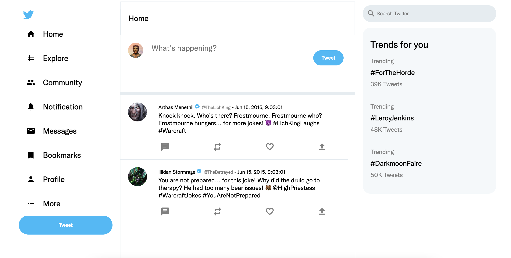
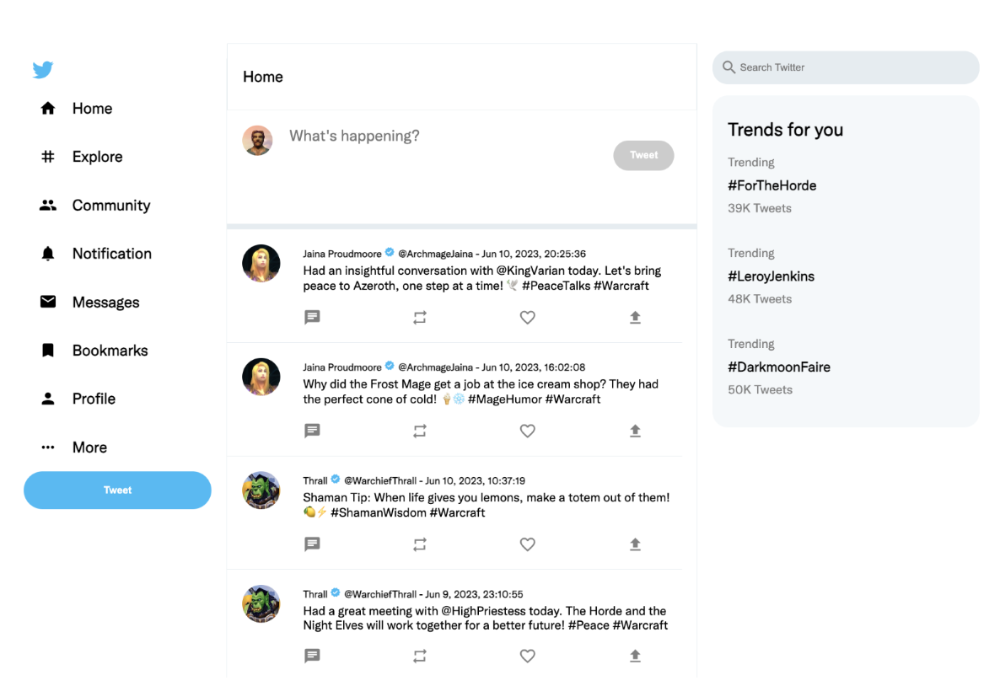
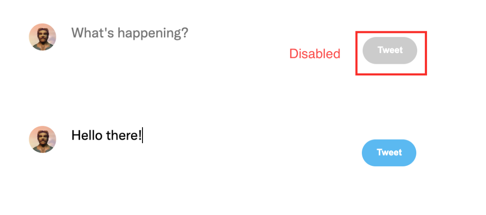

# Twitter

## Opdracht Twitter

In deze opgave gaan we stap voor stap een Twitter-achtige applicatie bouwen. We beginnen met een eenvoudig angular project met een paar componenten. Je hebt het home component dat de home pagina voorstelt met de twitter feed en een invoerveld om een nieuwe tweet te posten. We hebben ook een profile component dat een profiel pagina voorstelt. Het profile component bevat ook een lijst van tweets die gepost zijn door de eigenaar van de profile. In het begin project werken we volledig met statische HTML en CSS. Naarmate de opdracht vooruit gaat, zullen we meer en meer functionaliteit toevoegen aan de applicatie.

Als je de applicatie voor de eerste keer opstart zal je de home pagina zien.

<figure><figcaption></figcaption></figure>

Je kan ook de statische versie van de profile pagina bekijken door het component wisselen in het `app.component.html` bestand.

<figure><figcaption></figcaption></figure>

### Routing en componenten

#### LeftNav en RightNav

Het `Home` component en `Profile` component bevatten beiden een navigatiebalk langs de linkerkant (de nav-tag) en een blok langs de rechterkant (de aside-tag). Maak hiervoor 2 afzonderlijke componenten aan: `RightNav` en `LeftNav` en gebruik deze in de `Home` en `Profile` componenten.

<figure><figcaption></figcaption></figure>

#### Routing

De applicatie bevat 2 schermen.

* Scherm 1: De hoofdpagina met de algemene twitter feed. Dit komt overeen met het `Home` component.
* Scherm 2: Het profiel van een gebruiker met zijn tweets. Dit komt overeen met het `Profile` component.

Elk scherm is een afzonderlijke, reeds bestaande Angular Component.

Zorg dat er naar de verschillende schermen kan genavigeerd worden aan de hand van de url.

Zorg dat de gebruiker standaard steeds op het 1e scherm terecht komt als de applicatie wordt geopend met gebruik van de root Url (dus bv. http://localhost:4200/ ).

Zorg dat de gebruiker kan navigeren naar een profiel pagina. Deze pagina is beschikbaar via de url: http://localhost:4200/:handle. Zorg er dus voor dat het `Profile` component wordt getoond als de gebruiker naar een url met eender welke handle navigeert. Dus bv. http://localhost:4200/Cookie of http://localhost:4200/BansheeQueen gaan allemaal naar hetzelfde scherm.

## Home Component

Momenteel bevat het `Home` component nog enkel statische html. We gaan in dit onderdeel er voor zorgen dat de tweets dynamisch worden ingeladen.



Voer de volgende stappen uit:

* Maak een service aan die de waar je tweets en profielen mee kan ophalen. Je mag in deze fase de data nog hardcoden in de service. De data komt uit het `twitter.json` bestand.
* Maak interfaces aan voor Tweet en Profile.
* Zorg ervoor dat de tweets worden ingeladen in het `Home` component.
* Zorg ervoor dat de tweets worden ingeladen in chronologische volgorde (dus de meest recente tweet eerst). Toon deze tweets in het `Home` component. Er zijn twee voorbeeld tweets aanwezig in het `Home` component. Deze kan je verwijderen.
* Merk op dat sommige informatie over de gebruiker niet aanwezig is in de tweets. Je zal dus voor elke tweet de gebruiker moeten opzoeken in de lijst van profielen. Je kan hiervoor gebruik maken van de `handle` property van de tweet.
* Gebruik enkel interpolation om alle informatie van de tweet te tonen.
* De avatar van de gebruiker is een afbeelding die je kan vinden in de map `assets/images/avatars`. Je zal dus de juiste afbeelding moeten selecteren op basis van de `handle` property van de tweet.
* Als de gebruiker op de naam van de gebruiker klikt, navigeer dan naar de profiel pagina van de gebruiker.
* Zorg dat de `createdOn` datum van de tweet wordt getoond in een leesbaar formaat. Toon dit in het formaat: `MMM d, y, HH:mm:ss`.
* Zorg dat de `verified` badge enkel wordt getoond als de gebruiker geverifieerd is.

<figure><figcaption></figcaption></figure>

## Profile component

Momenteel bevat het \`Profile\` component nog enkel statische html. Dit gaan we in dit onderdeel veranderen.&#x20;

* Zorg ervoor dat de \`handle\` van de gebruiker uit de url wordt opgehaald en het profiel van de gebruiker wordt ingeladen. De gebruiker kan dus naar de profiel pagina van eender welke gebruiker navigeren.&#x20;
* Zorg ervoor dat alle informatie van de gebruiker wordt getoond op de profiel pagina.  &#x20;
* Gebruik enkel property binding om alle informatie van de gebruiker te tonen.&#x20;
* Toon onder de informatie van de gebruiker een lijst van zijn tweets. Deze tweets moeten ook in chronologische volgorde worden getoond. De informatie van de tweets moet op dezelfde manier worden getoond als in het \`Home\` component.&#x20;

<figure><figcaption></figcaption></figure>

### Child component

Momenteel merk je dat de `Profile` component en de `Home` component veel code gemeenschappelijk hebben. Het tonen van de tweets is in beide componenten hetzelfde. Plaats alle code die de tweets toont in een afzonderlijk component. Dit component kan je dan gebruiken in zowel de `Profile` component als de `Home` component. Maak gebruik van een `@Input` property om de tweets door te geven aan het component.

### Nest.js + MongoDB

Maak een nieuw Nest.js project aan. Dit project zal de REST API bevatten voor de Twitter applicatie.

Zorg voor de volgende endpoints:

* GET /tweets: geeft een lijst van alle tweets terug
* GET /tweets/:handle geeft een lijst van alle tweets terug van een bepaalde gebruiker
* POST /tweets: post een nieuwe tweet
* GET /profiles: geeft een lijst van alle profielen terug
* GET /profiles/:handle: geeft een profiel terug van een bepaalde gebruiker

Koppel de REST API aan een MongoDB database. Je mag deze database lokaal draaien of op cloud.mongodb.com.

Vergeet "app.enableCors()" niet toe te voegen aan de main.ts file van je Nest.js project.

### Nieuwe tweet posten

In dit onderdeel gaan we het posten van een nieuwe tweet implementeren.

Als de gebruiker op de `Tweet` button klikt, post dan de tweet naar de REST API. Gebruik als `handle` de hard gecodeerde waarde `JonDoe`. De `createdOn` datum moet de huidige datum zijn.

Als de tweet succesvol is gepost, haal dan de lijst van de tweets opnieuw op zodat de nieuwe tweet ook wordt getoond in de lijst van tweets.

Gebruik two-way binding om de tekst van het tekstveld te binden aan een property in het component.

Zorg ervoor dat de tekst van het tekstveld wordt leeggemaakt als de tweet succesvol is gepost.

Zorg ervoor dat de `Tweet` button wordt gedisabled als de gebruiker geen tekst heeft ingevuld en als de tekst langer is dan 140 karakters.

<figure><figcaption></figcaption></figure>

<figure><figcaption></figcaption></figure>